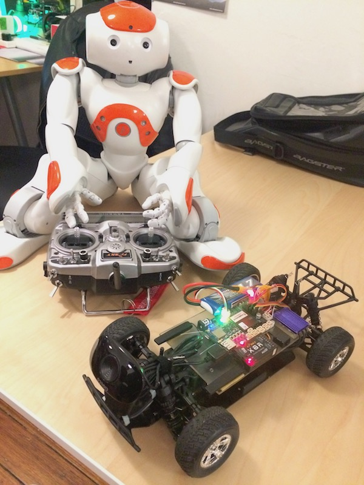
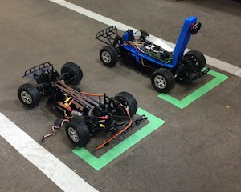

# Self-driving (scale model) car project

## Project team

## Hardware

### Bill Of Materials

[Mark Wolfe's]() has researched and created this
[Bill of Materials](https://docs.google.com/spreadsheets/d/e/2PACX-1vS4dDVcc-XSizIfDcnYqrwnpr3s2C9YOatZ-NBpMu1980PFuvVG0G8UBcrAg2bCNygeN5uCzEMGMFT9/pubhtml)

## Software installation

- Configure BeagleBone Blue
- Install ArduRover (flight controller)
- Install DroneKit (or similar)
- Install Video streaming

[Detailed software installation instructions](doc/software_install.md)
